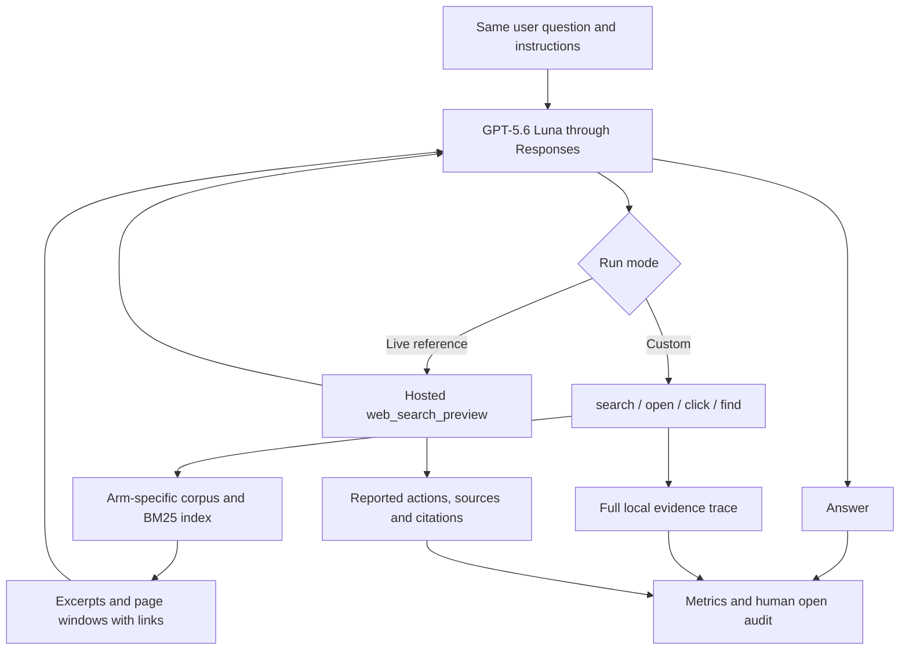

# Harness design and validation plan

## Purpose and evidence

Reproduce the available actions of a searching agent in a controlled information environment, so awards can be moved between a product page and a linked hub **before the model receives them**. The experiment is one end-to-end process per question: search → read evidence → optionally open/follow/find → answer.

Confirmed from the supplied handover photographs: the original reference uses GPT-5.6 Luna through Portkey with hosted `web_search_preview`; the custom agent uses search/open over a 53-page corpus. Reported averages were 6.4 versus 9.0 queries and 0.6 versus 2.8 opens. Those numbers came from differently sized samples in the handover. The original source, corpus and traces were not supplied here. This repository is a new implementation, not a verified copy of them.

The hypothesis is that tool output, coverage, batching or interface differences explain excess opens. No one of those explanations is established. Hosted-search raw excerpts, ranking and full candidate sets are not available through the documented `sources` field.

## Architecture

The custom mode never invokes hosted search, so live content cannot leak around the intervention. The live reference never receives experimental pages. Hosted built-in search cannot be intercepted by this client. The same API endpoint reduces one difference from the original handover, but neither this nor the same model name establishes equivalence to ChatGPT's product configuration.

## Treatments

| Arm | Product-page block | Hub in searchable corpus |
|---|---|---|
| baseline | Empty | No |
| inline | Award sentence | No |
| no_link | Empty | Yes |
| link_vague | See our awards + link | Yes |
| link_descriptive | Award sentence + link to details | Yes |

The surrounding content, insertion point, ranking algorithm, snippet algorithm and tool descriptions are fixed. Only the block and hub presence change. The treatment can legitimately affect ranking/snippets; that is part of this end-to-end experiment and must be measured. The descriptive arm exposes the award claim before a hub visit, so award mention alone is not proof of hub use.

## Retrieval decisions and assumptions

- Transparent BM25 over each page's title and text; deterministic URL tie-breaking. No external embeddings, citation-derived authority priors, or hand-tuned brand boosts.
- Query-relevant windows with configurable character budgets. No preference for rates, dollar signs or awards. Full Markdown links crossing window edges are retained, which may slightly exceed the nominal budget.
- Up to eight independent queries per search call; multiple custom calls may also be returned by a model response. Every query is logged separately from the action count.
- `open` is described neutrally, not discouraged or required. Large pages can be read in windows. `find` offers passage lookup without requiring another open.
- Link IDs become navigable only when their link is actually included in returned content. Both excerpts and page windows can expose links. This is a declared implementation assumption, not a claim about hosted search.
- URLs outside the corpus fail explicitly. Missing corpus coverage must be audited instead of silently replaced with live evidence.
- No special two-open cap. Emergency model-round/output budgets are visible in metadata. Hosted tool budget and custom model rounds count different things; reaching either makes the run unsuitable for an unqualified behavioural comparison.

## Measurements

The instrumented trace measures:

1. Search actions and individual search queries. Missing hosted query lists remain missing, not zero.
2. Local open attempts, successes, failures, repeated opens and unique URLs. A `click` that opens a page counts as an open. `find` is separate. Hosted `open_page` metadata is recorded separately; a completed action is not proof of an equivalent local content payload.
3. Exactly which local page passages and links were returned, and when they were submitted to the model.
4. Explicit product-to-hub navigation through `click`. A direct `open` of a previously seen URL has candidate provenance, not definitive causal attribution.
5. Final answers, citations in raw response items and reported token usage. Local content reach and citation are never conflated.

Primary business outcome to score in the real study: whether the target award evidence is represented in the final answer. Specify a rubric for correct award identity, product relevance and positive/neutral/negative treatment before measuring results. Link-following and hub-only evidence are mechanism outcomes. Automated answer judging is not implemented; the open audit and raw answers support manual scoring.

If the question is whether the hub is "as effective" as inline placement, define the largest practically acceptable reduction in visibility before the final study. A nonsignificant difference alone does not establish equivalence.

## Validation sequence within the study

1. **Plumbing checks:** fictional fixtures verify treatment isolation, link survival, state/history continuation, action counting and failure handling. These are not behavioural evidence.
2. **Unmodified pilot:** replace fixtures with a real, provenance-recorded corpus and a matched subset of the original questions. This phase should match the real current product content; do not assume the experimental award-free `baseline` is identical to the current live page. If the current page already has awards, construct a separate faithful calibration corpus/configuration before making comparisons.
3. **Excess-open audit:** inspect exact pre-open output and the new material obtained. Label information gap, verification, navigation, repeated read, failure or uncertain. Domain-level `site:` overlap is insufficient evidence of redundancy. Review useful facts, not just character counts. Do not use the model's retrospective explanation as ground truth.
4. **Controlled diagnosis:** change only the leading suspected cause (for example passage selection), then rerun matched questions. Keep calibration and held-out questions separate. Do not optimise against the five-arm outcome while tuning fidelity.
5. **Five-arm runs:** fresh model state per question/arm/repetition; shuffled job order; same model, instructions, reasoning, corpus snapshot and retrieval settings apart from treatment. Interleave live references to expose temporal changes when useful. The suite's seed controls job order, not model randomness.
6. **Sensitivity:** preselect a small set of plausible snippet lengths or retrieval/budget settings and repeat the treatment contrasts. Report effect sizes and uncertainty, ideally resampling at the question level because repetitions of the same question are related. Agreement across plausible configurations supports stability, not proof of transfer to hosted search.

The suite supplies repeatable execution and trace retention. `benchmark.py` now implements frozen profiles, paired question-cluster simultaneous equivalence bounds, distribution checks and explicit pass/different/inconclusive decisions; see `STATISTICS.md`. `award_report.py` implements manual scoring packets and paired treatment contrasts. Neither makes automatic causal judgments about individual opens or claims equivalence to the ChatGPT product. The actual study still requires a real question population, corpus and adjudicated scoring rubric.

## Minimum evidence before external claims

- Comparable question sets, categories and model settings, with model-returned identifiers retained.
- Corpus coverage checked against observable live consulted sources, including uncited sources where exposed by `web_search_call.action.sources`.
- Failures and budget-limited runs reported separately, not dropped without disclosure.
- Excess opens explained with concrete local traces; exact payload equivalence is not asserted.
- Treatment differences stable enough across repetitions and declared sensitivity settings for the intended business decision.

Until then, report findings as effects **inside this controlled harness**. No match in aggregate search/open counts establishes that it reproduces Luna's decision policy.
