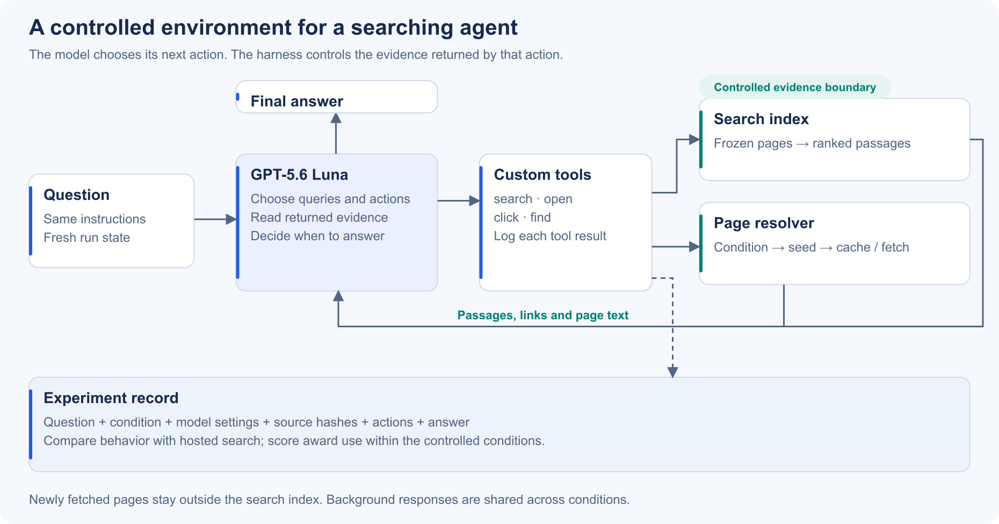
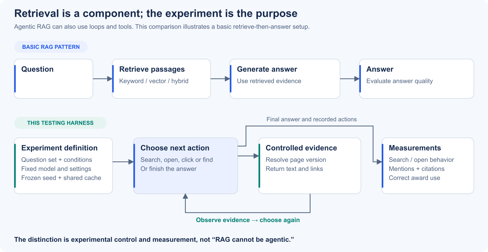
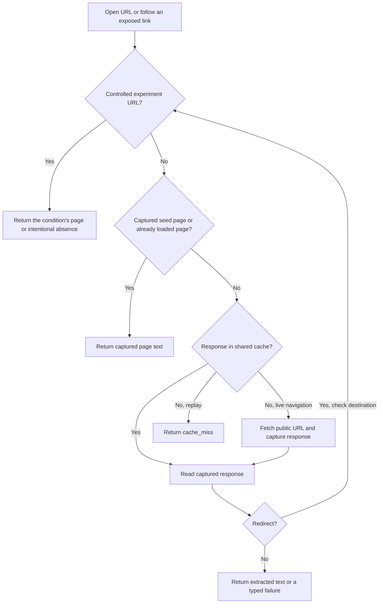
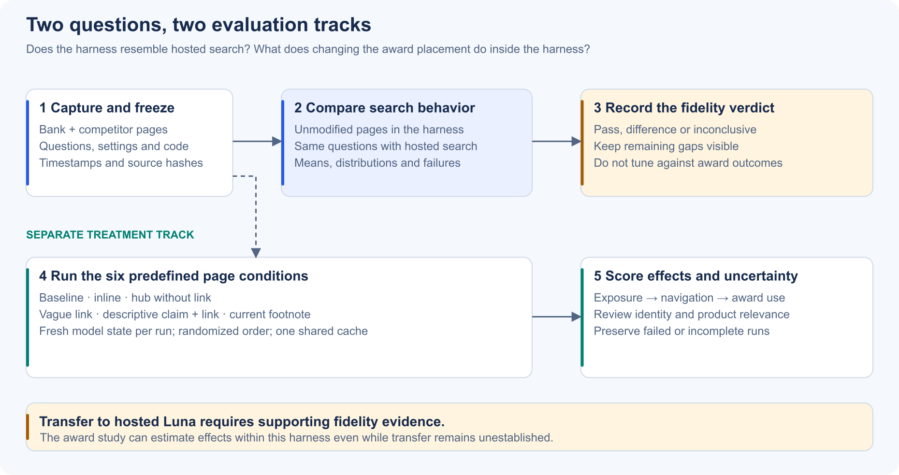

# Agentic search harness — design specification

**A controlled environment for testing how a searching AI discovers, reads and uses page content.** The harness lets us change a page before the model sees it, observe the model's search and navigation decisions, and compare outcomes across repeatable experiments.

The first application is a CommBank award-placement study: does an award appear in the answer differently when it is in the page body, a footnote or a linked award page? The experimental decision model is **GPT-5.6 Luna**. The design can support future page-content experiments, but each new setting needs its own applicable validation.

| Document field | Current position |
|---|---|
| Scope | Architecture, experimental controls, tool behavior and validation |
| Implementation | Navigation v2; controlled search with cached public-page navigation |
| Reference | Luna with hosted API web search; equivalence to the ChatGPT product is not established |
| Evidence status | URL-coverage defect fixed; behavioral equivalence **inconclusive** |
| Example corpus | 69 captured documents from CommBank, competitors and comparison sources |
| Last updated | 25 September 2026 |

[Purpose](#why-build-this) · [Offline meaning](#what-offline-means-here) · [RAG comparison](#how-this-differs-from-rag) · [Architecture](#architecture-and-agent-flow) · [Experiment](#experiment-design-commbank-award-placement) · [Validation](#validation-and-current-evidence) · [Implementation](#implementation-map)

*Figure 1. The harness controls tool responses; the model chooses its actions. [Editable SVG](docs/images/harness-architecture.svg).*

## Why build this?

We want to study a content change **before publishing it to a real website**. For example, moving an award from a legal footnote to a linked page could change whether an AI encounters it, follows the link and uses the claim in its answer. Those are separate events, and a final brand mention alone cannot explain the path between them.

A controlled harness provides four things:

| Need | Design response |
|---|---|
| Test a page variant before it is public | Apply the experimental page version before search excerpts or opened content reach the model. |
| Compare conditions against the same evidence | Freeze seed pages and settings; share captured background responses across conditions. |
| Understand how an answer was produced | Record queries, returned passages, exposed links, page reads, failures and the final answer. |
| Repeat and audit the experiment | Preserve code/corpus hashes, question sets, traces and response caches. |

Hosted search remains the behavioral reference. In this implementation, its retrieval runs inside the hosted tool: our client does not have a hook to replace a retrieved page before that tool gives evidence to the model. Changing an API proxy response after the hosted call therefore does not give us the same experimental control. Custom tools put that boundary inside our code.

This is a **text-evidence experiment**. It tests the effect of retrievable content and links. It does not simulate screen position, scrolling attention, visual prominence or the complete ChatGPT browsing system.

## What “offline” means here

“Offline testing” means testing against controlled page versions without deploying those changes to the public site. It does **not** imply that every run is disconnected from the internet.

| Navigation mode | Search evidence | Opening a URL outside the seed corpus | Network use |
|---|---|---|---|
| `offline` | Captured seed pages | Returns `not_in_corpus` | No page fetch; an actual model run still uses the API. |
| `live` — current experiment configuration | Captured seed pages | Uses the shared cache, or fetches and captures a public response | Model API plus page fetching on cache misses. |
| `replay` | Captured seed pages | Uses the supplied cache; an unseen URL returns `cache_miss` | No new page fetch; a new model run still uses the API. |

Replaying a **recorded sequence of tool calls** against the same code and cache can reproduce the evidence returned. Asking the model the question again is a new stochastic run: it can choose different queries or URLs. Fully offline scripted checks require no model call; they verify the tools, not Luna's behavior.

The current design is a hybrid: a fixed search collection plus navigation that can reach beyond it. Seed pages retain their capture dates, while background pages are captured on first demand. It is not a simultaneous snapshot of the entire web.

## How this differs from RAG

Retrieval-augmented generation (RAG) supplies retrieved information to a model so it can use that evidence in its answer. A basic implementation retrieves passages and then generates an answer. **Agentic RAG can also make repeated searches, choose tools and follow links**; these capabilities do not uniquely distinguish this harness.

The difference is the purpose and the surrounding experimental controls. This harness uses retrieval inside a system designed to manipulate evidence and measure behavior. It can reasonably be described as an experimental harness around an agentic retrieval system.

*Figure 2. A basic RAG pattern is shown for comparison; RAG is not restricted to this one-pass pattern. [Editable SVG](docs/images/rag-and-harness.svg).*

| Dimension | Typical RAG application | This harness |
|---|---|---|
| Main question | “Can the system answer using relevant documents?” | “How does changing the available page evidence affect search, navigation and the answer?” |
| Retrieval | Keyword, vector or hybrid search; may be agent-directed | Deterministic lexical page ranking with context-preserving passages |
| Agent control | Depends on the application; may include a tool loop | Luna chooses whether to search, open, click, find or answer |
| Evidence changes | Usually updated to improve the knowledge base | Deliberately varied by a registered experimental condition |
| Evaluation | Often relevance, grounding and answer quality | Those concerns plus action counts, distributions, exposure, navigation and treatment effects |
| Reproducibility | Depends on the application's versioning and tracing | Explicit corpus/code manifests, response hashes and retained traces |

A RAG system could adopt the same controls. The label alone does not establish experimental validity, and using embeddings would not automatically make this harness more faithful to hosted search.

## Architecture and agent flow

For each question and condition, the harness creates fresh run state and supplies the same model instructions and tool definitions. The model can request one or more tool calls, inspect their returned evidence and continue until it answers or reaches a declared execution limit.

**Question → model decision → tool action → controlled evidence → next decision → answer.** An answer can rely on search passages alone; opening a page is optional. The system never imposes an open quota to make its averages resemble the reference.

| Tool | Contract | What becomes observable |
|---|---|---|
| `search(queries)` | Search the condition's seed index; return ranked source passages, URLs and visible links | Individual queries, batches, passages and link exposure |
| `open(url, offset)` | Read a page window through the page resolver; direct, previously unseen URLs are allowed | Attempt, success/error, URL provenance and returned content |
| `click(page_url, link_id)` | Follow a link ID already exposed to the model | Explicit link following; counted as an open attempt |
| `find(url, text)` | Find matching passages in a previously exposed page | Within-page evidence lookup, counted separately from opens |

Current settings are context retrieval, five results per query, 6,000-character search excerpts, 32,000-character open windows, medium reasoning and eight model rounds. The hosted comparison has a tool-call budget; that is not identical to a custom model-round budget. Cutoffs must stay visible in the results.

### How a page is resolved

The condition check runs **before returning content and again at each redirect destination**. A cached original page cannot override the experimental version. A hub intentionally absent from a condition cannot be fetched back into it. Matching covers declared URLs/aliases and their scheme, `www`, trailing-slash and query variants; unrelated undeclared mirrors are not automatically identified.

For other pages, the shared cache stores **untreated responses**, including failures, with timestamps and hashes. Fetched pages become readable during the run but do not enter the search index. The seed index is fixed within a condition; the predefined treatment itself may change indexed text or hub availability across conditions.

This resolves the finite-corpus problem without enumerating every URL the model might guess. A real HTTP 404 remains an HTTP failure; a missing replay entry is a different event. HTML, PDFs and plain text use the declared extraction policy. Runtime navigation does not execute JavaScript or authenticate to websites. Details: [navigation contract](NAVIGATION.md).

## Experiment design: CommBank award placement

The example tests **“Canstar 2024 Digital Banking Bank of the Year”**, a bank-level award captured near the bottom of the CommBank savings page. The unchanged reference corpus is used for behavioral comparison. A separate experimental derivative supplies six conditions.

| Condition | Controlled savings-page content | Separate award hub |
|---|---|---|
| `baseline` | Target award footnote removed; no replacement block | Absent |
| `inline` | Award sentence immediately after the H1 | Absent |
| `no_link` | No award block or link at the intervention point | Searchable |
| `link_vague` | “See our awards” link | Searchable |
| `link_descriptive` | Award sentence plus a link to details | Searchable |
| `current_footnote` | Original bottom footnote restored | Absent |

The hub is an explicitly counterfactual local page. Other award evidence in background sources stays available. The baseline therefore does not mean “the model has no way to know the award.” The descriptive condition changes both claim exposure and the link; it cannot isolate link wording alone. Full treatment definitions: [CommBank design](COMMBANK_RUNBOOK.md).

*Figure 3. Behavioral similarity and treatment effects answer different questions. [Editable SVG](docs/images/experiment-lifecycle.svg).*

Keep model settings, instructions, retrieval rules and questions fixed across conditions. Start fresh model state for each question/condition/repetition, randomize job order and use one shared untreated response cache. The suite seed controls job order, not the model's randomness.

Measure the mechanism as well as the outcome: **was the claim returned, was a relevant link exposed, was the destination read, and was the award used correctly?** Human scoring checks award identity, product relevance and unsupported claims. Mentioning the bank or repeating an award does not by itself establish a correct recommendation.

## Validation and current evidence

Validation has two distinct layers:

| Layer | What it establishes | What it cannot establish |
|---|---|---|
| Functional verification | Tools resolve pages, preserve conditions, log failures and replay captured evidence correctly | That Luna makes the same decisions as hosted search |
| Behavioral comparison | How measured actions and answers differ on the chosen questions | Identical hidden search internals or automatic transfer to other corpora/tasks |

The comparison uses matched questions and repeated runs, with prespecified tolerances. It measures query counts separately from search batches; open attempts separately from successful reads; any-open frequency and count distributions; citations, provider mentions, answer length and completion. Repetitions share a question cluster and do not substitute for independent question diversity. Confidence intervals quantify uncertainty under the sampling assumptions, not a percentage probability that we have copied ChatGPT.

**Recorded navigation-v2 evidence:** 79 automated tests passed; all six previously failing URLs fetched and replayed successfully; all 76 custom tool outputs in the pilot reproduced exactly from cache. The diagnostic comprised six navigation-focused questions, twice per mode: 24 answers.

| Pilot observable | Custom harness | Hosted Luna |
|---|---:|---:|
| Queries per answer | 6.50 | 6.75 |
| Search batches per answer | 4.00 | 2.17 |
| Open attempts per answer | 2.33 | 0.00 |
| Answers with an open | 75% | 0% |
| Cited domains per answer | 2.58 | 2.50 |

All **28 custom opens succeeded**. Nevertheless, opening behavior differs substantially and formal equivalence remains **inconclusive**. These questions were informed by earlier failures; this was a diagnostic convenience sample. They also differ from the older offline comparison, so the two pilots do not establish a causal before/after effect of the navigation fix. The full 216-answer award experiment has not been run. [Results and evidence](VALIDATION.md).

Hosted search can return evidence through search without a separately reported open. The API exposes reported search/open/find actions, citations and consulted-source metadata; this is not a dump of every candidate result or the exact intermediate excerpts. We compare observable behavior, not an assumed view of its hidden retrieval process. [Official web-search documentation](https://developers.openai.com/api/docs/guides/tools-web-search).

### Design limits and next decision

The controlled search corpus differs from a web-scale index. Search evidence may differ in richness and selection; opening a page successfully does not make the opening policy equivalent. Text extraction also approximates graphical PDF tables. These are limits to review, not reasons to suppress inconvenient actions or widen tolerances after a run.

For a different corpus, preserve the same intervention boundaries and trace schema, but build a new reference snapshot, review extraction and compare behavior again on applicable questions. Do not inherit the CommBank similarity numbers. If the next task is to diagnose the remaining open gap, a matched before/after comparison on the same questions and an audit of pre-open evidence is a proposed next study—not a completed result.

## Implementation map

| Responsibility | Location |
|---|---|
| Model/tool loop and page variants | [search_lab.py](search_lab.py) |
| Context-preserving search passages | [context_passages.py](context_passages.py) |
| Public fetching, redirects and response replay | [navigation.py](navigation.py) |
| Source capture and corpus construction | [corpus_builder.py](corpus_builder.py), [commbank_setup.py](commbank_setup.py) |
| Frozen reference comparison and statistics | [benchmark.py](benchmark.py), [validation/](validation/), [STATISTICS.md](STATISTICS.md) |
| Randomized treatment runs and award scoring | [suite.py](suite.py), [award_report.py](award_report.py) |

### Supporting material

- [Execution guide](HANDOFF.md): installation, budgets and run commands. This README is the design specification.
- [Navigation contract](NAVIGATION.md): cache behavior, failure types and replay boundaries.
- [Validation record](VALIDATION.md): current limitations, numeric evidence and historical comparisons.
- [Reproducible navigation-v2 bundle](https://github.com/heyinwong/harness-gpt-luna-web-serach/releases/tag/navigation-v2): captured corpus, caches, code and raw traces; credentials excluded. Its documentation is frozen at release time; this README continues to evolve.
- [Diagram assets](docs/images/): PNGs for embedding in a wiki and editable SVG sources. The navigation flow above uses Mermaid.

Model runs require an API key and an explicit paid-run opt-in. Scripted offline checks do not. Keys stay outside Git and release bundles.
